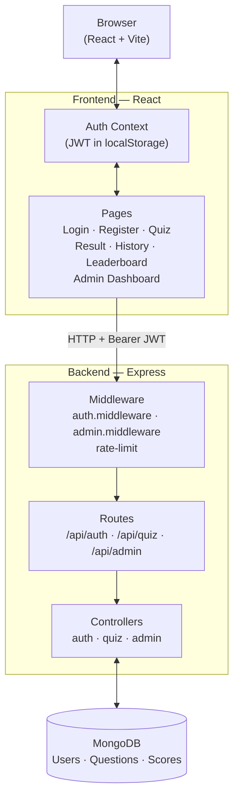

# COMP4347 Assignment 2 — MERN Stack Quiz Game

> Tutorial 02 · Group 8 · University of Sydney · Semester 1, 2026

---

## Team

| Name | Unikey | Role | Key Commits |
|------|--------|------|-------------|
| Aki Sato | csat9038 | Backend architecture, DB models, middleware, test suite, quiz/leaderboard/history pages, project scaffold | [models](https://github.sydney.edu.au/COMP4347-2026-S1-TUT02-G8/COMP4347_A2/commit/6812122) · [controllers](https://github.sydney.edu.au/COMP4347-2026-S1-TUT02-G8/COMP4347_A2/commit/507f146) · [middleware](https://github.sydney.edu.au/COMP4347-2026-S1-TUT02-G8/COMP4347_A2/commit/a851193) · [tests](https://github.sydney.edu.au/COMP4347-2026-S1-TUT02-G8/COMP4347_A2/commit/67ad7b1) · [admin dashboard UI](https://github.sydney.edu.au/COMP4347-2026-S1-TUT02-G8/COMP4347_A2/commit/6151870) |
| Tenko XVI | Arc5689 | Admin routes, admin login flow, UI polish, image URL variation | [admin route + UI](https://github.sydney.edu.au/COMP4347-2026-S1-TUT02-G8/COMP4347_A2/commit/9f8d432) · [admin login fix](https://github.sydney.edu.au/COMP4347-2026-S1-TUT02-G8/COMP4347_A2/commit/9ee0937) · [image variation](https://github.sydney.edu.au/COMP4347-2026-S1-TUT02-G8/COMP4347_A2/commit/4c9a491) |
| Brian Harrison | bhar5201 | Frontend styling, login page, dark mode | [login page](https://github.sydney.edu.au/COMP4347-2026-S1-TUT02-G8/COMP4347_A2/commit/2292aee) · [dark mode](https://github.sydney.edu.au/COMP4347-2026-S1-TUT02-G8/COMP4347_A2/commit/58d2650) |

---

## Tech Stack

- **Backend:** Node.js, Express, MongoDB, Mongoose
- **Frontend:** React (Vite), Material UI, React Hook Form, Zod
- **Auth:** JWT (Bearer token, stored in `localStorage`)
- **Testing:** Jest + Supertest

---

## Setup

### Prerequisites

- Node.js 18+
- MongoDB running locally **or** a MongoDB Atlas URI

### 1 — Clone

```bash
git clone git@github.sydney.edu.au:COMP4347-2026-S1-TUT02-G8/COMP4347_A2.git
cd COMP4347_A2
```

### 2 — Backend

```bash
cd backend
cp .env.example .env   # edit the values below
npm install
npm run dev            # starts on http://localhost:5000
```

**Environment variables** (`backend/.env`):

| Variable | Default | Description |
|----------|---------|-------------|
| `PORT` | `5000` | Port the Express server listens on |
| `MONGO_URI` | `mongodb://localhost:27017/quizgame` | MongoDB connection string (local or Atlas) |
| `JWT_SECRET` | *(required)* | Secret used to sign JWTs — use a long random string in production |
| `JWT_EXPIRES_IN` | `7d` | JWT expiry duration (e.g. `1d`, `7d`, `24h`) |

### 3 — Frontend

```bash
cd frontend
cp .env.example .env   # only needed if backend is not on port 5000
npm install
npm run dev            # starts on http://localhost:5173
```

**Environment variables** (`frontend/.env`):

| Variable | Default | Description |
|----------|---------|-------------|
| `VITE_API_URL` | *(empty — uses Vite proxy)* | Set to full backend URL only when deploying without the dev proxy (e.g. `http://localhost:5000`) |

### 4 — Seed the database

```bash
cd backend
npm run seed           # clears existing questions and inserts sample data
```

### 5 — Create an admin account

The seed script does **not** create an admin user. Do it once via the API:

```bash
# 1. Register a normal account
curl -X POST http://localhost:5000/api/auth/register \
  -H "Content-Type: application/json" \
  -d '{"username":"admin","password":"yourpassword"}'

# 2. Promote it to admin directly in MongoDB
mongosh quizgame --eval 'db.users.updateOne({username:"admin"},{$set:{role:"admin"}})'
```

---

## Architecture



**Request flow:**
1. React page calls an API endpoint with `Authorization: Bearer <jwt>` header.
2. `auth.middleware` verifies the JWT; `admin.middleware` checks `role === 'admin'`.
3. Controller reads/writes MongoDB and returns `{ success, data?, error? }`.

---

## Approved Variation — Image-Based Questions

**Variation:** *Image-based questions* — questions may include an optional image displayed above the question text during the quiz.

**What was implemented:**

| Layer | Change |
|-------|--------|
| `Question` model | Optional `imageUrl: String` field (defaults to `""`) |
| `GET /api/quiz/questions` | `imageUrl` included in sanitised response sent to players |
| `POST /api/admin/questions` | Accepts and stores `imageUrl` |
| `PUT /api/admin/questions/:id` | Updates `imageUrl` |
| `POST /api/admin/questions/bulk` | `imageUrl` supported per question in the JSON array |
| Admin question form | Image URL input field + live preview below the field |
| Admin dashboard table | Thumbnail column shows a 56×40 preview for questions with images |
| Quiz page | Image rendered above question text when `imageUrl` is non-empty |
| Seed data | ≥ 50 % of seeded questions include a real image URL |

**Justification:** Images add meaningful context to factual and visual questions (geography, science, art), making the quiz more engaging. The implementation is entirely additive — `imageUrl` is optional on both the model and every API endpoint, so existing questions without images are unaffected. The rubric requires ≥ 50 % of questions to include an image; the seed enforces this and the admin dashboard makes it easy to verify.

Full implementation guide: [`docs/IMAGE-VARIATION.md`](docs/IMAGE-VARIATION.md)

---

## API Documentation

Import [`docs/api.postman_collection.json`](docs/api.postman_collection.json) into Postman for an interactive collection with example requests and responses.

**Base URL:** `http://localhost:5000`  
**Response envelope:** all endpoints return `{ success: boolean, data?: any, error?: string }`

### Auth — `/api/auth`

| Method | Endpoint | Auth | Description |
|--------|----------|------|-------------|
| `POST` | `/api/auth/register` | None | Register new user → returns JWT + role |
| `POST` | `/api/auth/login` | None | Login → returns JWT + role _(rate limited: 10 req / 15 min)_ |

<details>
<summary>POST /api/auth/register</summary>

**Body**
```json
{ "username": "player1", "password": "secret" }
```
**201**
```json
{ "success": true, "data": { "token": "<jwt>", "role": "user" } }
```
**409** — `"Username already taken"`
</details>

<details>
<summary>POST /api/auth/login</summary>

**Body**
```json
{ "username": "player1", "password": "secret" }
```
**200**
```json
{ "success": true, "data": { "token": "<jwt>", "role": "user" } }
```
**401** — `"Invalid credentials"`
</details>

---

### Quiz — `/api/quiz`

| Method | Endpoint | Auth | Description |
|--------|----------|------|-------------|
| `GET` | `/api/quiz/questions` | User JWT | 6–10 shuffled active questions (`correctIndex` never sent) |
| `POST` | `/api/quiz/submit` | User JWT | Submit answers → score saved + returned _(rate limited: 5 req / 1 min)_ |
| `GET` | `/api/quiz/leaderboard` | None | Top 10 players by personal best |
| `GET` | `/api/quiz/attempts` | User JWT | Authenticated user's past attempts |

<details>
<summary>GET /api/quiz/questions</summary>

**Headers:** `Authorization: Bearer <token>`  
**200**
```json
{
  "success": true,
  "data": [
    {
      "_id": "664abc...",
      "text": "Which planet is red?",
      "options": ["Venus", "Mars", "Jupiter", "Saturn"],
      "imageUrl": "https://example.com/mars.jpg"
    }
  ]
}
```
**503** — `"Not enough active questions (minimum 6 required)"`
</details>

<details>
<summary>POST /api/quiz/submit</summary>

**Headers:** `Authorization: Bearer <token>`  
**Body**
```json
{
  "answers": [
    { "questionId": "664abc...", "selectedIndex": 1 },
    { "questionId": "664def...", "selectedIndex": 3 }
  ]
}
```
**200**
```json
{ "success": true, "data": { "score": 7, "total": 10 } }
```
</details>

<details>
<summary>GET /api/quiz/leaderboard</summary>

**200**
```json
{
  "success": true,
  "data": [
    { "username": "player1", "score": 10 },
    { "username": "player2", "score": 8 }
  ]
}
```
</details>

<details>
<summary>GET /api/quiz/attempts</summary>

**Headers:** `Authorization: Bearer <token>`  
**200**
```json
{
  "success": true,
  "data": [
    { "score": 7, "total": 10, "createdAt": "2026-05-01T10:00:00.000Z" }
  ]
}
```
</details>

---

### Admin — `/api/admin`

All admin endpoints require `Authorization: Bearer <admin-jwt>` (`role === "admin"`).

| Method | Endpoint | Description |
|--------|----------|-------------|
| `GET` | `/api/admin/questions` | List all questions (active + inactive) |
| `POST` | `/api/admin/questions` | Create one question |
| `PUT` | `/api/admin/questions/:id` | Replace a question |
| `DELETE` | `/api/admin/questions/:id` | Delete a question |
| `PATCH` | `/api/admin/questions/:id/toggle` | Flip `active` flag |
| `POST` | `/api/admin/questions/bulk` | Bulk import JSON array |

<details>
<summary>POST /api/admin/questions — body</summary>

```json
{
  "text": "What is the capital of France?",
  "options": ["Berlin", "Madrid", "Paris", "Rome"],
  "correctIndex": 2,
  "imageUrl": "https://example.com/paris.jpg"
}
```
`imageUrl` is optional. **201** returns the saved document.
</details>

<details>
<summary>POST /api/admin/questions/bulk — body</summary>

```json
{
  "questions": [
    {
      "text": "Which planet is red?",
      "options": ["Venus", "Mars", "Jupiter", "Saturn"],
      "correctIndex": 1,
      "imageUrl": "https://upload.wikimedia.org/wikipedia/commons/thumb/0/02/OSIRIS_Mars_true_color.jpg/320px-OSIRIS_Mars_true_color.jpg"
    },
    {
      "text": "What is 2 + 2?",
      "options": ["3", "4", "5", "6"],
      "correctIndex": 1
    }
  ]
}
```
All questions are validated before any are inserted. **400** response lists failing indices:
```json
{ "success": false, "error": "2 question(s) failed validation", "data": [0, 3] }
```
</details>
