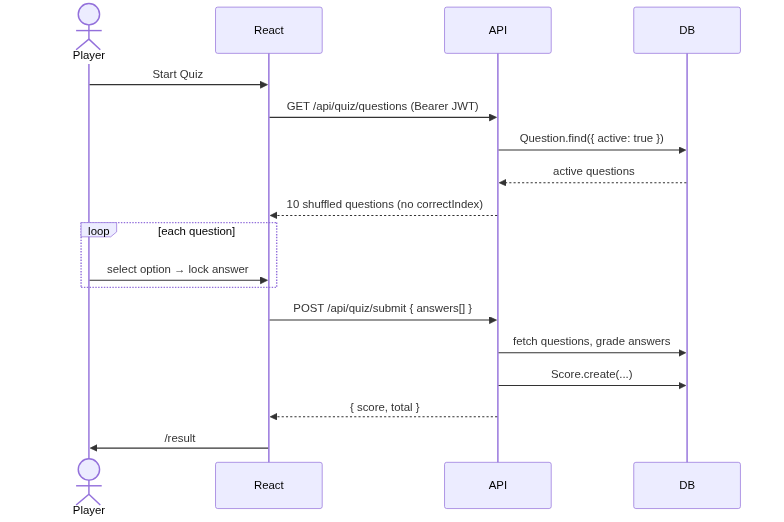

## Primary Subsystem

I owned the full backend (models, controllers, routes, middleware, tests), the player-side frontend (Quiz, Result, History, Leaderboard, Auth context), and the admin frontend (Dashboard, Question Form, Bulk Import, Protected Routes). As one of three members I shared responsibility for integration, validation, and robustness.

---

## Technical Challenge — Leaderboard Showing Duplicate Users

Initial implementation returned the top 10 *attempts*, so one player could appear multiple times. I replaced the simple query with an aggregation pipeline that groups by user and takes their personal best:

```js
// commit 2093816
const entries = await Score.aggregate([
  { $group: { _id: "$userId", username: { $first: "$username" },
               score: { $max: "$score" } } },
  { $sort: { score: -1 } },
  { $limit: 10 },
  { $project: { _id: 0, username: 1, score: 1 } },
]);
```

I also denormalised `username` onto `Score` at submit time so the aggregation needs no `$lookup`. Found via manual testing — seeding one user with multiple attempts exposed duplicate leaderboard entries.

---

## Sequence Diagram — Quiz Flow

*See attached diagram below.*

{width=70%}

---

## Commit History

| Hash | Date | What |
|------|------|------|
| [`33b3ee5`](https://github.sydney.edu.au/COMP4347-2026-S1-TUT02-G8/COMP4347_A2/commit/33b3ee5) | 2026-04-30 | Project scaffold |
| [`6812122`](https://github.sydney.edu.au/COMP4347-2026-S1-TUT02-G8/COMP4347_A2/commit/6812122) | 2026-05-01 | Backend models — User, Question, Score |
| [`507f146`](https://github.sydney.edu.au/COMP4347-2026-S1-TUT02-G8/COMP4347_A2/commit/507f146) | 2026-05-04 | All controllers (auth, quiz, admin) |
| [`a851193`](https://github.sydney.edu.au/COMP4347-2026-S1-TUT02-G8/COMP4347_A2/commit/a851193) | 2026-05-04 | auth + admin middleware |
| [`67ad7b1`](https://github.sydney.edu.au/COMP4347-2026-S1-TUT02-G8/COMP4347_A2/commit/67ad7b1) | 2026-05-04 | Test suite — behaviours specified by me, implementation AI-assisted |
| [`8cc56ff`](https://github.sydney.edu.au/COMP4347-2026-S1-TUT02-G8/COMP4347_A2/commit/8cc56ff) | 2026-05-01 | Auth context + useAuth hook |
| [`7964fb3`](https://github.sydney.edu.au/COMP4347-2026-S1-TUT02-G8/COMP4347_A2/commit/7964fb3) | 2026-05-01 | Quiz state reducer (LOADING / ACTIVE / SUBMITTED) |
| [`d27f928`](https://github.sydney.edu.au/COMP4347-2026-S1-TUT02-G8/COMP4347_A2/commit/d27f928) | 2026-05-01 | Quiz page — question flow, answer locking |
| [`318498b`](https://github.sydney.edu.au/COMP4347-2026-S1-TUT02-G8/COMP4347_A2/commit/318498b) | 2026-05-01 | Result, History, Leaderboard pages |
| [`6151870`](https://github.sydney.edu.au/COMP4347-2026-S1-TUT02-G8/COMP4347_A2/commit/6151870) | 2026-05-08 | Admin dashboard frontend |
| [`2093816`](https://github.sydney.edu.au/COMP4347-2026-S1-TUT02-G8/COMP4347_A2/commit/2093816) | 2026-05-08 | Fix leaderboard — aggregation pipeline, personal best |
| [`229928f`](https://github.sydney.edu.au/COMP4347-2026-S1-TUT02-G8/COMP4347_A2/commit/229928f) | 2026-05-08 | Protected + Admin route wrappers |
| [`eb34b03`](https://github.sydney.edu.au/COMP4347-2026-S1-TUT02-G8/COMP4347_A2/commit/eb34b03) | 2026-05-04 | Fix Mongoose options validator (Mongoose 8 breaking change) |
| [`5996518`](https://github.sydney.edu.au/COMP4347-2026-S1-TUT02-G8/COMP4347_A2/commit/5996518) | 2026-05-08 | Fix test env — NODE_ENV guard to skip rate limits |

---

## Variation — Design Decisions

The image-based questions variation was primarily implemented by Chong An. My contribution was reviewing the integration and verifying the quiz controller's sanitised response included `imageUrl` without exposing `correctIndex`.

---

## Integration & Robustness

Uniform `{ success, data?, error? }` envelope on all endpoints. Validation before every DB write (bulk import validates all items before `insertMany`). Rate limiting on login (10 req/15 min) and submit (5 req/1 min), bypassed in test env. `GET /api/quiz/questions` returns 503 when fewer than 6 active questions exist.
